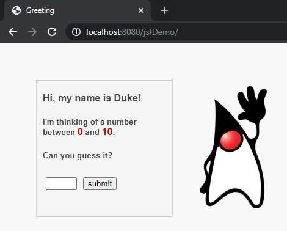
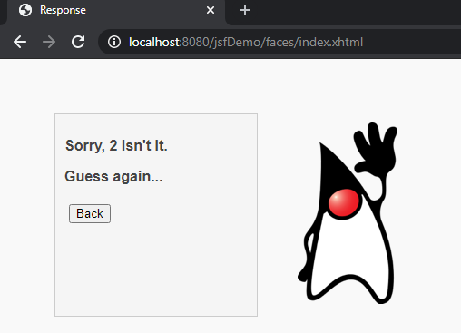
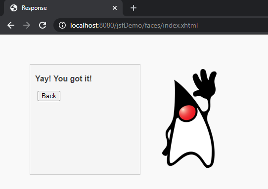

<h1 align="center">
    Project: jsfDemo
    <h1 align="center">
    
    </h1>
    <h3 align="center">Simple example given in the field of Technologies for WEB Development.</h3>
</h1>

 

## 💻 Project

jsfDemo was created with the purpose of introducing in a simple way the content of java server faces for beginners.

  

    <strong style="font-size: 18px">Web-Home</strong>
    <h1 align="center" style="margin-right: 28px">
      
    </h1>
  

  

    <strong style="font-size: 18px">Web-Home-Wrong-Attempt</strong>
    <h1 align="center">
      
    </h1>
  

  

    <strong style="font-size: 18px">Web-Home-Correct-Attempt</strong>
    <h1 align="center">
      
    </h1>
  

 
 

---

Made with ♥ by Alexandre Sobota :wave: [Get in touch!](https://www.linkedin.com/in/alexandre-sobota)