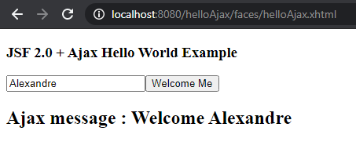

<h1 align="center">
    Project: helloAjax by Alexandre Sobota
    <h1 align="center">
    
    </h1>
    <h3 align="center">The helloAjax application introduces the concept of AJAX and was made for learning purposes.</h3>
</h1>

 

## 💻 Project

The helloAjax application returns a message with a username entered in the field.

  

    <strong style="font-size: 18px">Ajax-Home</strong>
    <h1 align="center" style="margin-right: 28px">
      
    </h1>
  

  

    <strong style="font-size: 18px">Ajax-Home-Message</strong>
    <h1 align="center">
      
    </h1>
  

  

    <strong style="font-size: 18px">Ajax-Home-Final-Version</strong>
    <h1 align="center" style="margin-right: 28px">
      
    </h1>
  

 
 

---

Made with ♥ by Alexandre Sobota :wave: [Get in touch!](https://www.linkedin.com/in/alexandre-sobota)