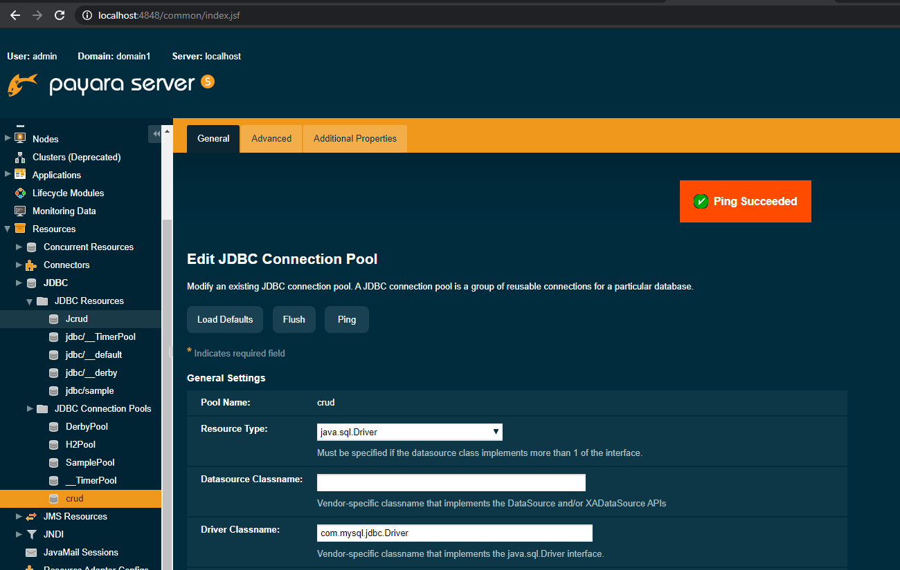
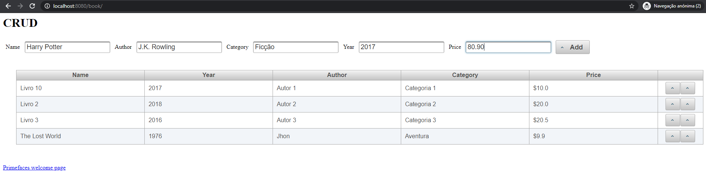
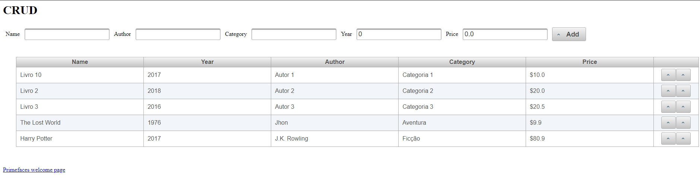
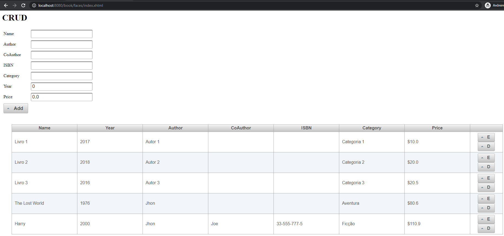

<h1 align="center">
    Project: Book by Emily Saraiva
    <h1 align="center">
    
    </h1>
    <h3 align="center">Simple example of an application that performs the CRUD (create, read, update and delete).</h3>
</h1>

 

## 💻 Project

Book is an application that performs the CRUD (create, read, update and delete) of books in a library.

  

    <strong style="font-size: 18px">Connection to Payara Server</strong>
    <h1 align="center" style="margin-right: 28px">
      
    </h1>
  

  

    <strong style="font-size: 18px">Crud-Home</strong>
    <h1 align="center">
      
    </h1>
  

  

    <strong style="font-size: 18px">Crud-Home-Harry</strong>
    <h1 align="center">
      
    </h1>
  

  

    <strong style="font-size: 18px">Crud-Final-Version</strong>
    <h1 align="center">
      
    </h1>
  

 
 

---

Emily Saraiva :wave: [Get in touch!](https://www.linkedin.com/in/emily-saraiva/)