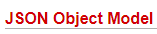
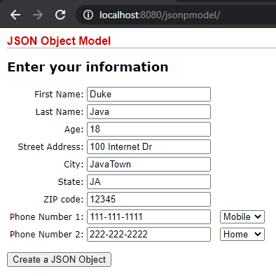
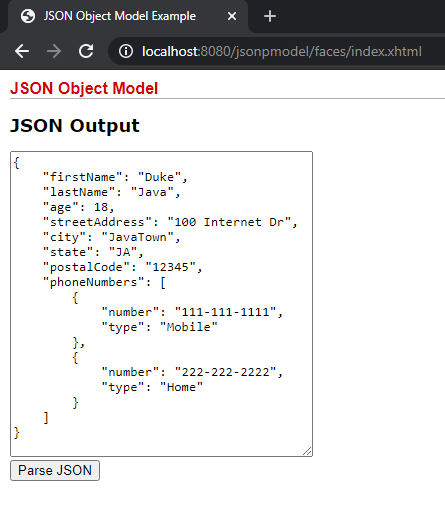
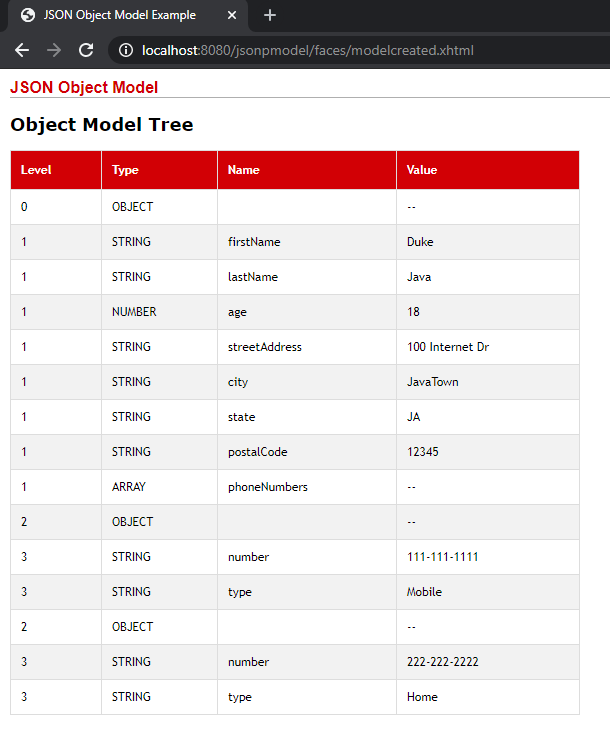
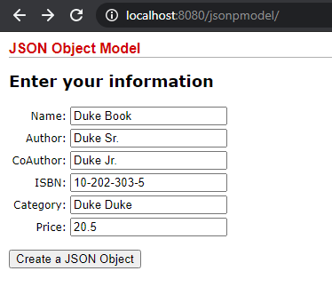
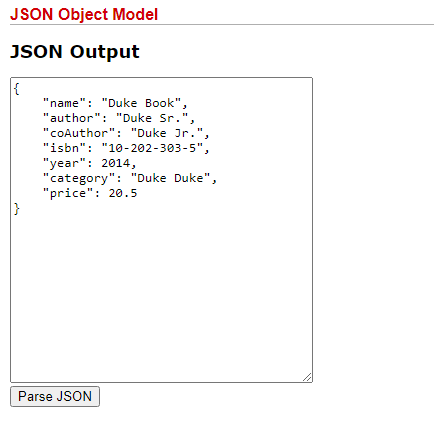
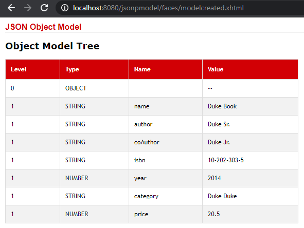

<h1 align="center">
    Project: jsonpmodel by Emily Saraiva
    <h1 align="center">
    
    </h1>
    <h3 align="center">A simple project that introduces the concept of JSON for learning purposes.</h3>
</h1>

 

## 💻 Project

The application jsonpmodel demonstrates in a simple way how a form is converted to JSON format.

  

    <strong style="font-size: 18px">Form with data</strong>
    <h1 align="center" style="margin-right: 28px">
      
    </h1>
  

  

    <strong style="font-size: 18px">JSON-Format</strong>
    <h1 align="center">
      
    </h1>
  

  

    <strong style="font-size: 18px">Parse-JSON</strong>
    <h1 align="center">
      
    </h1>
  

    <strong style="font-size: 18px">Form with data - Final Version</strong>
    <h1 align="center" style="margin-right: 28px">
      
    </h1>
  

  

    <strong style="font-size: 18px">JSON-Format-Final-Version</strong>
    <h1 align="center">
      
    </h1>
  

  

    <strong style="font-size: 18px">Parse-JSON-Final-Version</strong>
    <h1 align="center">
      
    </h1>
  

 
 

---

by Emily Saraiva :wave: [Get in touch!](https://www.linkedin.com/in/emily-saraiva/)